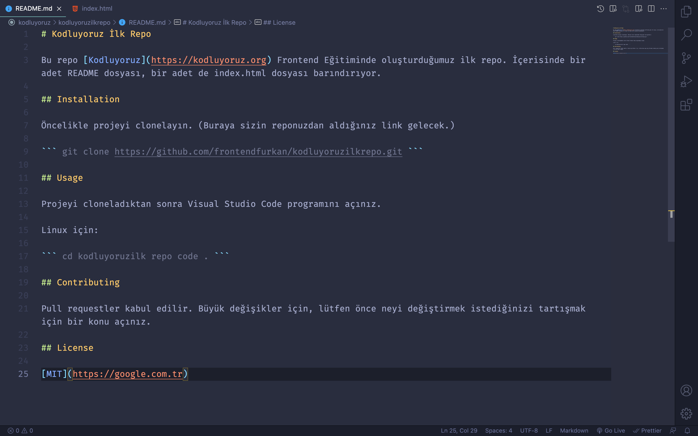

# Kodluyoruz İlk Repo

Bu repo [Kodluyoruz](https://kodluyoruz.org) Frontend Eğitiminde oluşturduğumuz ilk repo. İçerisinde bir adet README dosyası, bir adet de index.html dosyası barındırıyor.



## Installation

Öncelikle projeyi clonelayın. (Buraya sizin reponuzdan aldığınız link gelecek.)

``` git clone https://github.com/frontendfurkan/kodluyoruzilkrepo.git ```

## Usage

Projeyi cloneladıktan sonra Visual Studio Code programını açınız.

Linux için: 

``` cd kodluyoruzilk repo code . ```

## Contributing

Pull requestler kabul edilir. Büyük değişikler için, lütfen önce neyi değiştirmek istediğinizi tartışmak için bir konu açınız.

## License

[MIT](https://google.com.tr)